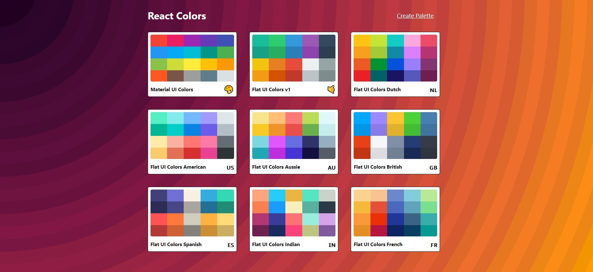
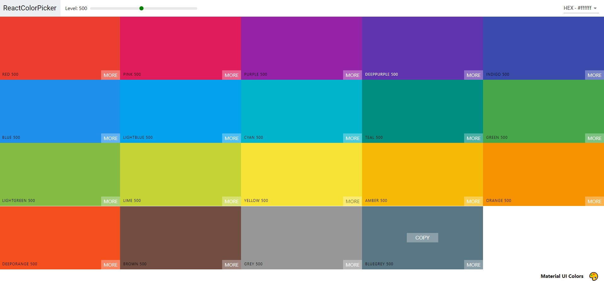
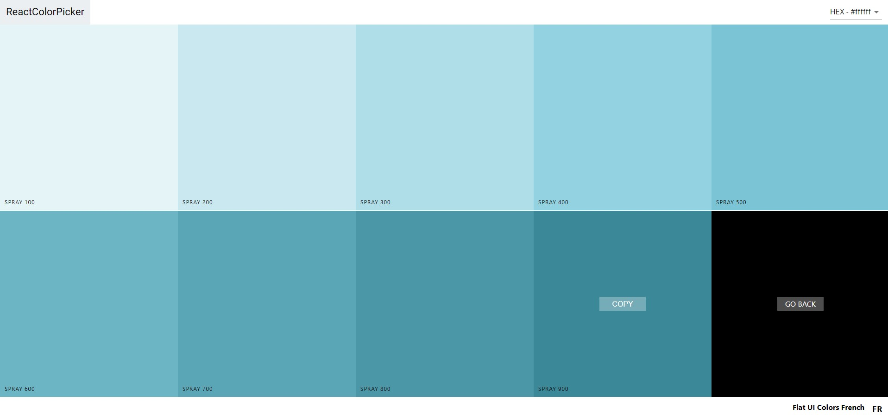
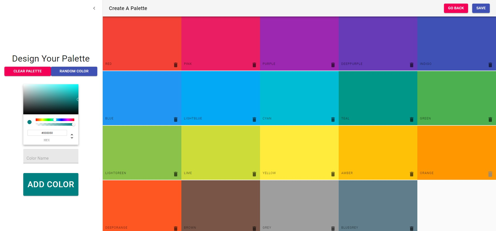

#  Color Picker Application

 

A color picker application which is a clone of Material-UI colors & Flat-UI colors made using React JS, Material UI.

The application is composed of the following Features:

### Front-End
* A landing page with animated minimalistic design, with the major categories of palettes.
* An individual palette page consisting of different shades of a color.
* A single page consisting of different shades of a color.
* Each color is available in hex, rgb & rgba color codes.
* Each user can also create palette of his/her choice by simply clicking on create a palette & selecting color of his/her choice.

**SCREENSHOTS:**

Landing Page:


---
Colors Preview:


---
Individual Colors Page:


---
New Palette Page:



---

## Developed With

* [Visual Studio Code](https://code.visualstudio.com/) - A source code editor developed by Microsoft for Windows, Linux and macOS. It includes support for debugging, embedded Git control, syntax highlighting, intelligent code completion, snippets, and code refactoring
* [React](https://reactjs.org/) - A javascript library for building user interfaces
* [Create react app](https://create-react-app.dev/) - A quick method to start developing a react application.
* [Babel](https://babeljs.io/) - A transpiler for javascript
* [Webpack](https://webpack.js.org/) - A module bundler

---

## Quick Start

Clone the repository and do following:

```bash
# Install dependencies for client
npm install or yarn install

# Run the client 
npm start or yarn start
```